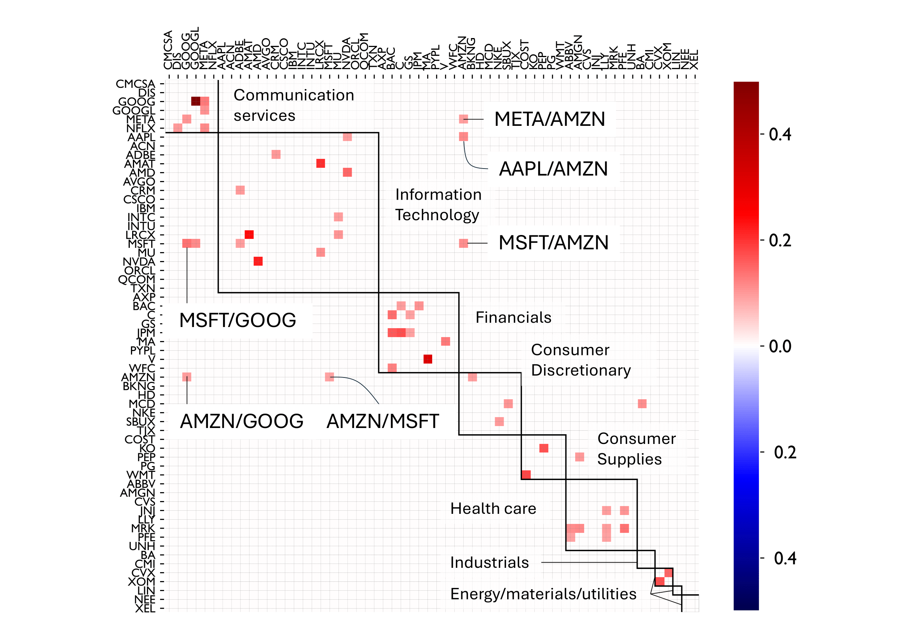
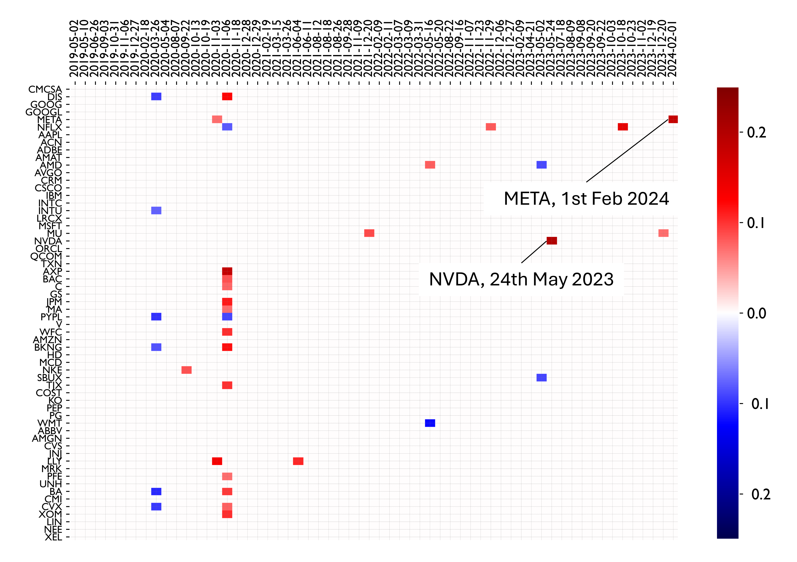

<div align="center">
  
# SpinSVAR: Estimating Structural Vector Autoregression Assuming Sparse Input  
**Panagiotis Misiakos & Markus Püschel**  
<sub>To appear in: *Uncertainty in Artificial Intelligence (UAI), 2025*</sub>

</div>

---

## Overview

**SpinSVAR** is a novel method for estimating a structural vector autoregression (SVAR) model from time-series data under a **sparse input** assumption. The method formulates a **maximum likelihood estimator** (MLE) based on least absolute error regression by modeling the input as i.i.d. Laplacian variables.

For a quick demo, check out [`SpinSVAR_demo.ipynb`](SpinSVAR_demo.ipynb).

If you find this repository useful please cite:

```
@inproceedings{misiakos2025spinsvar,
      title={SpinSVAR: Estimating Structural Vector Autoregression Assuming Sparse Input}, 
      author={Panagiotis Misiakos and Markus Püschel},
      publisher = {To appear in: Uncertainty in Artificial Intelligence},
      year={2025},
}
```
---
## Key Results

### 1. Dependencies Between S&P 500 Stocks

SpinSVAR uncovers economically meaningful structures in stock returns. When applied to S&P 500 data, it clusters stocks by sector and reveals significant **structural shocks** linked to market behavior.

<p align="center">
  
</p>

> **Interpretation**:  
> The learned $\widehat{\mathbf{B}}_0$ matrix roughly clusters stocks according to their economic sectors. Some outliers (e.g., large IT firms) span sectors:
> - **MSFT** influences **GOOG** and **AMZN**  
> - **META**, **AAPL**, and **MSFT** influence **AMZN**  
> - **AMZN** influences **GOOG** and **MSFT**  
>  
> Notably, the weights of $\widehat{\mathbf{B}}_0$ are positive, indicating that these stocks tend to move together: when one rises or falls, the others follow.

---

### 2. Structural Shocks in the S&P 500

By estimating the SVAR input from S&P 500 time series, SpinSVAR captures **unexpected economic events** as structural shocks.

<p align="center">
  
</p>

> **Examples**:  
> - **Feb 1, 2024**: META shows a positive shock of **+0.18** — the same day it announced its first-ever dividend.  
> - **May 24, 2023**: NVDA shows a shock of **+0.20** — coinciding with an upward forecast due to rising AI demand.

---

## Installation

The code runs successfully on **Windows 11** and **macOS Sequoia 15.4.1** with **Python 3.9.7**.

### 1. Create and activate a conda environment:

```bash
conda create -n spinsvar python=3.9.7
conda activate spinsvar
```

### 2. Install required libraries:

```bash
# install all requirements with pip
pip install -r requirements.txt
```

And you are all set!
